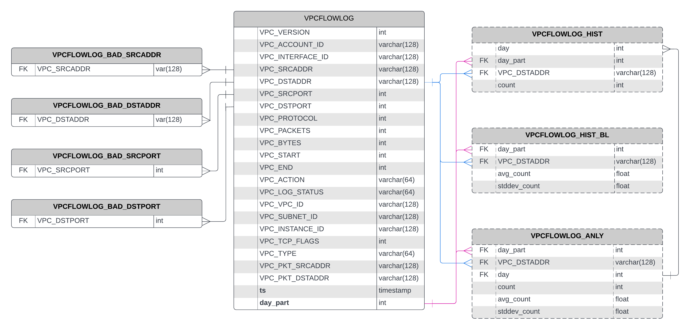

# DBOS Log Analysis on VPC Logs
## 5 Rules
### Aggregate rules/ queries
- Rejected/Failed SSH connections threshold of k within a duration
- New high throughput external connection

### Look-up rules/ queries
- Communication with IPs that have bad reputation (known IOCs)
- Probing from TOR exit nodes
- Unauthorized destination port

## Table Schema

- `ts`: formatted timestamp using `VPC_START`
- `day_part`: partition/ interval within the day (e.g. if consider 30-min
  interval, a day has 48 partitions)
- dotted boxes are views

## Connect to database
```
ssh -i deere-jd.pem ubuntu@ec2-100-24-25-169.compute-1.amazonaws.com
docker exec -it vertica_ce /opt/vertica/bin/vsql
```

## Look-up Queries

<details>

<summary> Details </summary>

### Lookup rules
Create 4 tables for each of the known bad source/ destination addresses/ ports
(ingest as more are discovered)

### Experiment
- Randomly populate each of the 4 tables with 10 (distinct) rows
- Query over all logs to detect if any log matched the bad fields

</details>


#### Template
```sql
SELECT COUNT(*) FROM VPCFLOWLOG_TEST t1 WHERE [[CONDITIONS]];
```

#### Example
```sql
SELECT COUNT(*) FROM VPCFLOWLOG_TEST t1 WHERE t1.VPC_DSTADDR IN (SELECT VPC_DSTADDR FROM VPCFLOWLOG_BAD_DSTADDR);

SELECT COUNT(*) FROM VPCFLOWLOG_TEST t1 WHERE t1.VPC_DSTADDR IN (SELECT VPC_DSTADDR FROM VPCFLOWLOG_BAD_DSTADDR) OR t1.VPC_SRCADDR IN (SELECT VPC_SRCADDR FROM VPCFLOWLOG_BAD_SRCADDR) OR t1.VPC_DSTPORT IN (SELECT VPC_DSTPORT FROM VPCFLOWLOG_BAD_DSTPORT) OR t1.VPC_SRCPORT IN (SELECT VPC_SRCPORT FROM VPCFLOWLOG_BAD_SRCPORT);
```

## Aggregate Queries
### Rule 1: New high throughput connection
**Strategy**: compare current statistics with rolling baselines

<details>

<summary> Details </summary>

**Views**: a stored query that dynamically access and compute data at execution
time, so it’s always up-to-date
- `VPCFLOWLOG_HIST`: histogram of incoming traffic to a particular destination
  within an interval on a day
- `VPCFLOWLOG_HIST_BL`: Summarize over a period of days to obtain several
  statistics of the incoming traffic on a particular day interval (e.g. average,
  standard deviation)
- `VPCFLOWLOG_ANLY`: Join VPCFLOWLOG_HIST with VPCFLOWLOG_HIST_BL to compare
  count with baseline statistics

**Experiment**: From `VPCFLOWLOG_ANLY`, fetch all logs that is one standard
deviation above/ below the average

</details>

#### Template
```sql
SELECT COUNT(*) FROM VPCFLOWLOG_ANLY WHERE [[CONDITIONS]];
```

#### Example
```sql
SELECT COUNT(*) FROM VPCFLOWLOG_ANLY WHERE count > avg_count + stddev_count OR count < avg_count - stddev_count;

SELECT COUNT(*) FROM VPCFLOWLOG_ANLY WHERE count > avg_count + stddev_count;

SELECT COUNT(*) FROM VPCFLOWLOG_ANLY WHERE count > avg_count + 2 * stddev_count OR count < avg_count - stddev_count;
```

### Rule 2: Rejected SSH connections more than 20 times within half an hour

<details>

<summary> Details </summary>

**View**
- Filter the logs by destination port = 22 and action = `reject`
- Group by `day`, interval within the day, and source address

**Experiment**:
<!-- - Group by produces a view of 284K rows -->
- From the histogram, fetch all logs with count > 20
<!-- - Query takes ~400ms -->
</details>

#### Template
```sql
SELECT COUNT(*) FROM VPCFLOWLOG_HIST2 WHERE [[CONDITIONS]];
```

#### Example
```sql
SELECT COUNT(*) FROM VPCFLOWLOG_HIST2 WHERE count > 20;
```

## Summary
### Performance
| #logs/ #files | Ingest into database | Lookup queries | Aggregate query 1 | Aggregate query 2 |
|---------------|----------------------|----------------|-------------------|-------------------|
| 1M (12K)      | ~42s                 | ~761ms         | ~510ms            | ~400ms            |
| 17M (47K)     | ~5min 30s            | 9650ms         | 6729ms            | 3317ms            |

- Query performances scale well even when the number of logs increases significantly

### Tuning
- A lot of knobs in our implementation can be easily tuned (e.g. interval within
  the day, metrics interested)
- We can also leverage machine learning to help better determine thresholds

<!-- ## Next steps
Multi-source logs
- One source of log (e.g VPC logs only) might not be indicative
- It would be more convincing if evidence from multiple sources are combined

Multi-level/ hierarchical logs (subset of multi-source logs)
- Hard to obtain semantics information from low-level logs
  - VPC logs can at best provide bytes transferred
- Application-level logs are more semantically richer and can provide additional
  insights
- With the DBOS function-as-a-service architecture, application-level logs are
  more readily available -->
